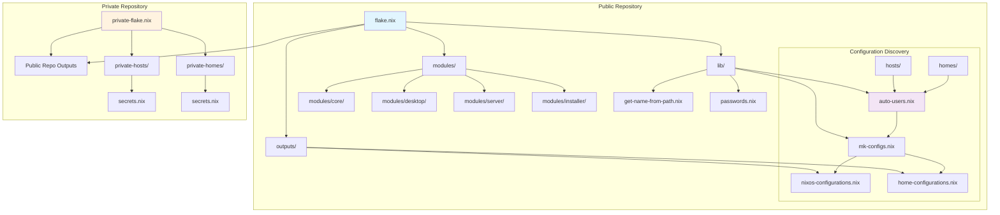
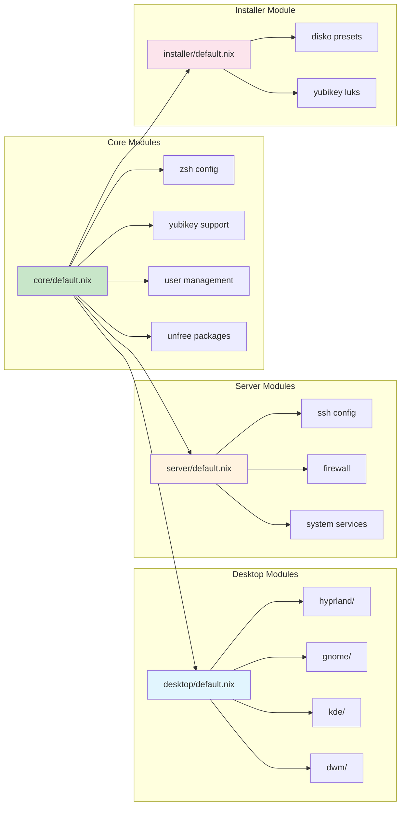
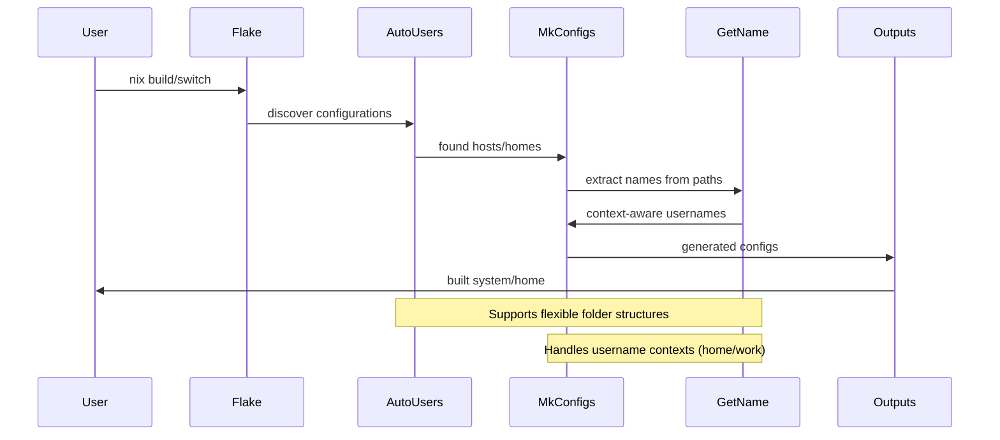
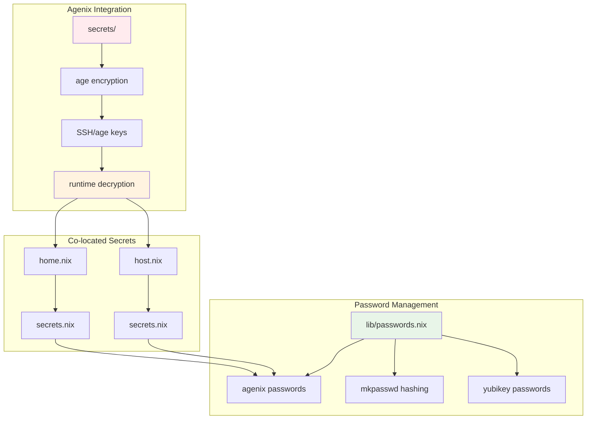
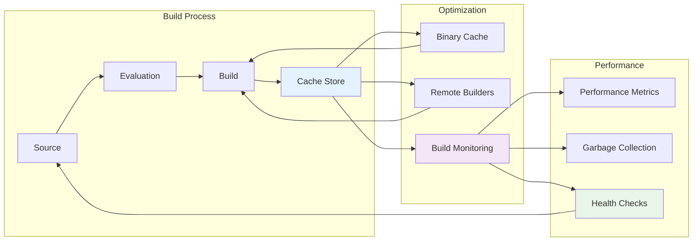
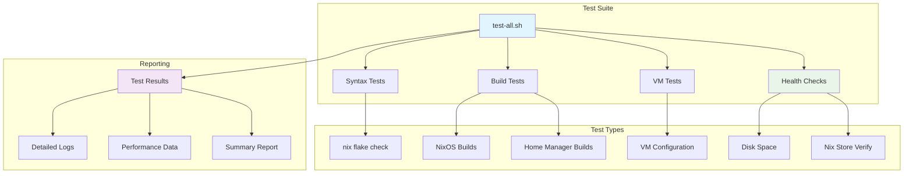
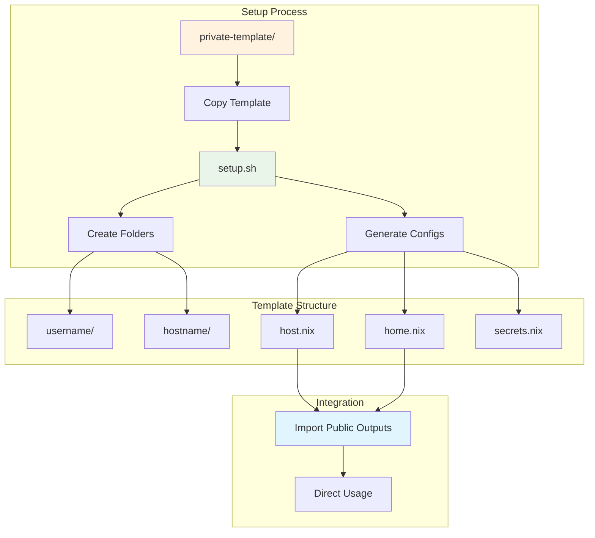

# Architecture Overview

## System Architecture

## Module Dependency Graph

## Configuration Flow

## Secrets Management Architecture

## Build Optimization Flow

## Testing Architecture

## Private Repository Integration

